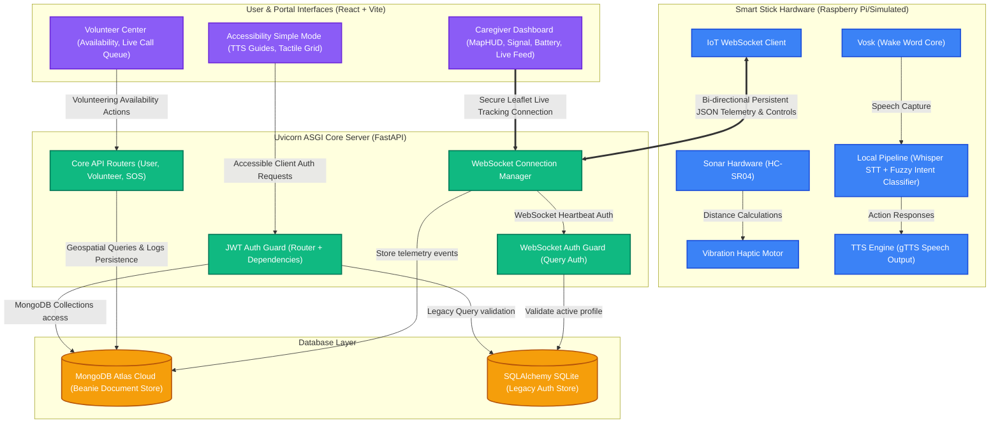

# System Architecture & Design Document
## Smart Vision Assistive Ecosystem

---

### 1. High-Level System Architecture Diagram



---

### 2. Bi-directional WebSocket Telemetry Engine

```
  IoT Client                               Backend WS Manager                           Caregiver UI
   ┌───┐                                         ┌───┐                                     ┌───┐
   │   │                                         │   │                                     │   │
   │   │─── 1. Authenticate WS (access_token) ──►│   │                                     │   │
   │   │◄── 2. Connection Accepted ──────────────│   │                                     │   │
   │   │                                         │   │◄── 3. Subscribe User Dashboard ─────│   │
   │   │                                         │   │                                     │   │
   │   │─── 4. Periodic Telemetry (GPS, Battery) ►│   │                                     │   │
   │   │                                         │   │─── 5. Forward Telemetry Event ─────►│   │
   │   │                                         │   │                                     │   │
   │   │◄── 7. Control Instructions (Turn 15°) ──│   │◄── 6. Send Nav Command / Helper ────│   │
   └───┘                                         └───┘                                     └───┘
```

The WebSocket layer maintains absolute connectivity for telemetry streaming and instant commands:
1. **Handshake & Auth Validation**:
   * The IoT client establishes a persistent connection to: `ws://<domain>/ws/iot?token=<jwt_access_token>`.
   * The server runs `get_ws_user()` to validate the access token. If validated, the connection is added to `ConnectionManager.active_connections`.
2. **Heartbeat & Telemetry Streams**:
   * The physical/mock device pushes JSON payloads at regular intervals containing GPS coordinates, signal quality, and battery metrics.
   * Telemetry values update the `Device` collection in MongoDB, and the `ConnectionManager` broadcasts the telemetry event payload to all listening caregiver portals.
3. **Control Signals & Command Delivery**:
   * Caregivers can transmit real-time instructions (e.g., immediate navigation updates) from the Dashboard. These bypass long polling APIs and are routed directly to the active device stream via standard WebSocket packets.

---

### 3. Speech-to-Intent Pipeline (Conversational Interface)

The local IoT Voice Engine runs as an asynchronous hardware thread executing a high-precision, low-latency pipeline:

```
  ┌──────────────┐      ┌─────────────┐      ┌─────────────────┐
  │ Vosk Core    │      │ OpenAI      │      │ Levenshtein     │
  │ (Wake Word)  │ ───► │ Whisper     │ ───► │ Fuzzy Matcher   │
  │ [Hey Vision] │      │ (Speech-STT)│      │ (Intent Engine) │
  └──────────────┘      └─────────────┘      └────────┬────────┘
                                                      │
  ┌──────────────┐      ┌─────────────┐               │
  │ gTTS Vocal   │ ◄─── │ Hardware /  │ ◄─────────────┘
  │ Responses    │      │ API Action  │
  └──────────────┘      └─────────────┘
```

* **Wake Word Trigger**: The system monitors ambient mic inputs using the lightweight `Vosk` engine, listening for the wake word `"Vision"`. Once detected, it emits an audio chime to notify the user.
* **Recording & Transcription**: The mic captures the user's sentence and transcribes it using an optimized, lightweight local instance of `OpenAI Whisper` (`tiny` size).
* **Intent Extraction**: The transcribed text is sent to the `IntentClassifier`. This utilizes fuzzy match Levenshtein scoring (via the `FuzzyWuzzy` library) to classify the query against predefined intent patterns.
* **Execution & Speech Response**: The system executes the corresponding API actions (e.g., triggering an SOS alert, querying transit schedules, checking battery levels) and generates natural audio feedback using `gTTS`.

---

### 4. Geospatial Proximity Matching (WebRTC Calls)

To optimize matching visually impaired users with active volunteers, the system utilizes MongoDB's highly optimized geospatial query indexing:

```javascript
// Volunteer Document Structure
{
  "user_id": ObjectId("..."),
  "is_available": true,
  "location": {
    "type": "Point",
    "coordinates": [77.6075, 12.9755] // [lng, lat]
  }
}
```

#### Geospatial Search Implementation
When a help request is initiated:
1. The server runs a query using the `$nearSphere` search operator against the `2dsphere` index configured on the `volunteers` collection:
   ```python
   volunteers = await Volunteer.find({
       "is_available": True,
       "location": {
           "$nearSphere": {
               "$geometry": {"type": "Point", "coordinates": [lng, lat]},
               "$maxDistance": 5000 // 5 kilometers maximum range limit
           }
       }
   }).to_list()
   ```
2. The nearest available volunteer is targeted and sent a real-time notification.
3. Upon acceptance, the system coordinates a peer-to-peer **WebRTC connection** to stream high-definition, low-latency video and audio from the user's camera module directly to the volunteer's browser.

---

### 5. Double-Database Harmonization Design

To address the coexistence of SQLite and MongoDB, we will completely migrate the authentication model to MongoDB Atlas.

#### Phase 1: Models Consolidation
We will map and clean up `models/user.py` and `models/token.py` as our primary Beanie documents:
```python
# models/user.py
class User(Document):
    email: Indexed(EmailStr, unique=True)
    hashed_password: str
    role: UserRole = UserRole.BLIND_USER
    is_verified: bool = False
    full_name: str = ""
    phone: str = ""
    city: str = ""
```

#### Phase 2: Router Refactoring
Refactor `backend/auth/router.py` to replace standard SQLAlchemy sessions with direct async Beanie/MongoDB queries.
* **Legacy SQL**:
  ```python
  user = db.query(User).filter(User.email == req.email).first()
  ```
* **New Beanie Async MongoDB**:
  ```python
  user = await User.find_one(User.email == req.email)
  ```

#### Phase 3: Dependencies Migration
Modify `backend/auth/dependencies.py` to extract active users asynchronously from MongoDB using Pydantic ObjectId formats instead of SQL auto-increment integers.
* **New Beanie Async WebSocket Resolver**:
  ```python
  user = await User.get(PydanticObjectId(user_id))
  ```
